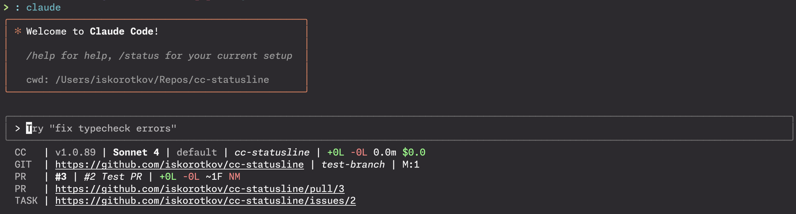
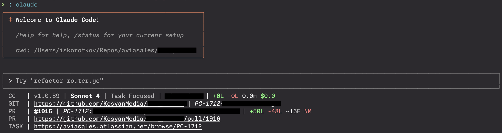

# cc-statusline



---



---

[](https://github.com/iskorotkov/cc-statusline/actions?query=workflow%3ACI)
[](https://go.dev/)
[](https://github.com/iskorotkov/cc-statusline/releases/latest)
[](LICENSE)
[](https://goreportcard.com/report/github.com/iskorotkov/cc-statusline)

A customizable statusline tool for Claude Code that displays real-time session information, Git status, GitHub PR details, and task tracking links in your terminal.

## Table of Contents

- [Features](#features)
- [Prerequisites](#prerequisites)
- [Installation](#installation)
- [Configuration](#configuration)
- [Usage](#usage)
- [Output Format](#output-format)
- [Development](#development)
- [Architecture](#architecture)
- [Troubleshooting](#troubleshooting)
- [Contributing](#contributing)
- [License](#license)

## Prerequisites

- Go 1.25 or later
- Git CLI (for Git status information)
- GitHub CLI (`gh`) - **optional** (for PR information, falls back gracefully if missing)
- Terminal with ANSI color support

## Features

- **Claude Code Session Info**: Display current model, version, output style, working directory, session stats (lines added/removed, duration, cost), and 200K+ context indicator
- **Git Integration**: Show remote origin URL, current branch, file change status, and diff statistics (lines added/removed)
- **GitHub PR Integration**: Display PR number, title, statistics, merge status, and URL
- **Task Tracking**: Automatically extract and link to task/issue numbers from branch names and PR head ref names
- **Styled Output**: Rich terminal formatting with colors, bold, italic, and underline styles

## Installation

### Using go install
```bash
go install github.com/iskorotkov/cc-statusline@latest
```

### Build from source
```bash
git clone https://github.com/iskorotkov/cc-statusline.git
cd cc-statusline
go build -o cc-statusline .
```

## Configuration

### Claude Code Setup

To use this statusline with Claude Code, add the following to your Claude Code settings file (`~/.claude/settings.json`):

```json
{
  "statusLine": {
    "type": "command",
    "command": "cc-statusline",
    "padding": 0
  }
}
```

If you want to include task tracking integration, set the `CC_TASK_SERVER` environment variable in the command:

```json
{
  "statusLine": {
    "type": "command",
    "command": "CC_TASK_SERVER='https://github.com/iskorotkov/cc-statusline/issues' cc-statusline",
    "padding": 0
  }
}
```

For Jira integration:
```json
{
  "statusLine": {
    "type": "command",
    "command": "CC_TASK_SERVER='https://yourcompany.atlassian.net/browse' cc-statusline",
    "padding": 0
  }
}
```

### Environment Variables

- `CC_TASK_SERVER`: Base URL for your task tracking system (e.g., `https://jira.example.com/browse`). When set, the tool will extract task IDs from branch names and PR head ref names and generate clickable links.

Example:
```bash
export CC_TASK_SERVER="https://github.com/iskorotkov/cc-statusline/issues"
```

## Usage

The tool reads Claude Code hook data from stdin and outputs a formatted statusline:

```bash
# Example with formatted JSON for readability
cat <<EOF | cc-statusline
{
  "session_id": "test-session-456",
  "version": "1.0.0",
  "model": {
    "id": "claude-3-5-sonnet-20241022",
    "display_name": "Claude 3.5 Sonnet"
  },
  "output_style": {
    "name": "detailed"
  },
  "workspace": {
    "project_dir": "/home/user/projects/my-project",
    "current_dir": "/home/user/projects/my-project/src"
  },
  "cost": {
    "total_lines_added": 150,
    "total_lines_removed": 75,
    "total_api_duration_ms": 5000,
    "total_cost_usd": 1.25
  },
  "exceeds_200k_tokens": true
}
EOF

# Or as a one-liner for quick testing
echo '{"session_id":"test","version":"1.0.0","model":{"display_name":"Claude 3.5 Sonnet"},"output_style":{"name":"detailed"},"workspace":{"project_dir":"/home/user/project","current_dir":"/home/user/project/src"},"cost":{"total_lines_added":150,"total_lines_removed":75,"total_api_duration_ms":5000,"total_cost_usd":1.25},"exceeds_200k_tokens":true}' | cc-statusline
```

### Output Format

The statusline displays information in multiple rows:

```
CC   v1.0.0 | Claude 3.5 Sonnet | detailed | src | +150L -75L 0.1m $1.25 | 200K+
GIT  https://github.com/iskorotkov/cc-statusline | main | M:5 A:2 D:1 | +25L -10L
PR   #42 | Fix authentication bug | +200L -50L ~8F M
PR   https://github.com/iskorotkov/cc-statusline/pull/42
TASK https://github.com/iskorotkov/cc-statusline/issues/42
```

Each row shows different information:
- **CC**: Claude Code version, model, output style, current directory, session statistics, context size indicator
- **GIT**: Remote origin URL (underlined), current branch (italic), file status (M=modified, A=added, D=deleted, etc.), and diff stats (lines added/removed from HEAD)
- **PR**: Pull request number, title, statistics (lines added/removed, files changed), mergeable status
- **TASK**: Extracted task/issue URL based on branch name and PR head ref name patterns

## Development

### Building
```bash
go build -o cc-statusline .
```

### Testing
```bash
go test -v -race ./...
```

### Linting
```bash
golangci-lint run
```

### Formatting
```bash
go fmt ./...
```

### Quality Checks
```bash
# Run all quality checks before submitting PRs
go vet ./...
go test ./...
golangci-lint run
```

### Input Schema

The tool expects JSON input matching the `CCHook` structure:

```json
{
  "session_id": "string",
  "version": "string",
  "model": {
    "id": "string",
    "display_name": "string"
  },
  "output_style": {
    "name": "string"
  },
  "workspace": {
    "project_dir": "string",
    "current_dir": "string"
  },
  "cost": {
    "total_lines_added": 0,
    "total_lines_removed": 0,
    "total_api_duration_ms": 0,
    "total_cost_usd": 0.0
  },
  "exceeds_200k_tokens": false
}
```

> **For detailed development commands, testing patterns, and contribution guidelines, see [CLAUDE.md](CLAUDE.md)**

## Architecture

The project follows a modular architecture with composable parts:

- `main.go`: Entry point and statusline composition
- `parts/`: Individual statusline components (Git, GitHub, Claude Code info)
- `shell/`: Command execution utilities
- `style/`: Terminal formatting functions

Each statusline component is a `Part` - a function that takes context and hook data and returns a formatted string. Parts are composed using `Row()` and `Rows()` functions to build the complete statusline.

> **For Developers:** See [CLAUDE.md](CLAUDE.md) for detailed technical documentation, development guidelines, testing patterns, and comprehensive examples for extending the statusline functionality.

## Troubleshooting

### Installation Issues

#### Command not found: cc-statusline
```bash
# Ensure Go bin directory is in your PATH
export PATH=$PATH:$(go env GOPATH)/bin

# Or check your GOBIN directory
go env GOBIN
```

#### Permission denied
```bash
# Make sure the binary is executable
chmod +x $(which cc-statusline)

# Or if using Claude Code settings, check file permissions
ls -la ~/.claude/settings.json
```

### Configuration Issues

#### Statusline not appearing in Claude Code
1. Verify your `~/.claude/settings.json` configuration:
   ```json
   {
     "statusLine": {
       "type": "command",
       "command": "cc-statusline",
       "padding": 0
     }
   }
   ```

2. Test the command manually:
   ```bash
   echo '{"version":"1.0.0"}' | cc-statusline
   ```

3. Check Claude Code logs for error messages

#### Environment variables not working
```bash
# Verify environment variable is set
echo $CC_TASK_SERVER

# For Claude Code integration, ensure the variable is in the command:
{
  "statusLine": {
    "command": "CC_TASK_SERVER='https://your-jira.com/browse' cc-statusline"
  }
}
```

### Runtime Issues

#### Empty statusline output
1. **Check if you're in a Git repository:**
   ```bash
   git status
   git remote -v
   ```

2. **Test with minimal input:**
   ```bash
   echo '{}' | cc-statusline
   ```

#### Git information not showing
```bash
# Verify Git is installed and accessible
git --version

# Check if you're in a Git repository
git rev-parse --git-dir

# Verify remote origin exists
git remote get-url origin
```

#### GitHub PR information missing
**Note:** GitHub CLI is optional - the tool works without it, but PR information won't be displayed.

```bash
# Check if GitHub CLI is installed and authenticated
gh --version
gh auth status

# Verify repository access
gh repo view
gh pr list
```

#### Task tracking links not appearing
1. Ensure `CC_TASK_SERVER` is set correctly
2. Check branch naming convention or PR head ref name (should contain issue/task numbers)
3. Example branch/PR ref names that work:
   - `feature/PROJ-123-add-auth` → extracts `PROJ-123`
   - `bugfix/issue-456` → extracts `issue-456`
   - `JIRA-789-implement-api` → extracts `JIRA-789`
   - `hotfix/123-critical-fix` → extracts `123`
   - `enhancement/ABC123-feature` → extracts `ABC123`
   - `fix/#456-urgent-bug` → extracts `#456`

### Display Issues

#### Colors not appearing
```bash
# Check terminal ANSI support
echo -e "\033[31mRed Text\033[0m"

# Try running in a different terminal
# Common terminals with good ANSI support: iTerm2, Terminal.app, GNOME Terminal
```

#### Unicode characters not displaying
- Ensure your terminal font supports Unicode
- Try a different terminal font (e.g., JetBrains Mono, Fira Code)

#### Statusline too long/wrapping
- Reduce terminal width or adjust Claude Code window size
- Consider customizing the statusline to show fewer components

### Performance Issues

#### Slow statusline generation
```bash
# Check for slow Git operations
time git status
time git remote get-url origin

# Check GitHub CLI performance
time gh pr list --limit 1

# Profile the tool (for developers)
go test -bench=. -benchmem
```

### Common Error Messages

#### "fatal: not a git repository"
- Navigate to a Git repository directory
- Initialize Git if needed: `git init`

#### "gh: command not found"
- GitHub CLI is optional; the tool will work without it
- Install with: `brew install gh` (macOS) or download from GitHub

#### "context deadline exceeded"
- Network timeouts when fetching GitHub data
- Check internet connection
- Verify GitHub API rate limits: `gh api rate_limit`

### Getting Help

If you continue to experience issues:

1. **Check the logs:** Look for error messages in Claude Code output
2. **Test manually:** Run the command directly in your terminal
3. **File an issue:** Report bugs at [GitHub Issues](https://github.com/iskorotkov/cc-statusline/issues)
4. **Provide details:**
   - Operating system and version
   - Terminal type and version
   - Claude Code version
   - Full error messages
   - Output of `cc-statusline` when run manually

## Contributing

Contributions are welcome! Please feel free to submit a Pull Request.

To add a new statusline component:

1. Create a new function in the `parts/` package that returns a `Part`
2. Implement the logic to extract and format your information
3. Add your part to the composition in `main.go`
4. Submit a PR with your changes

## License

MIT License - see [LICENSE](LICENSE) file for details

## Author

Ivan Korotkov ([@iskorotkov](https://github.com/iskorotkov))
